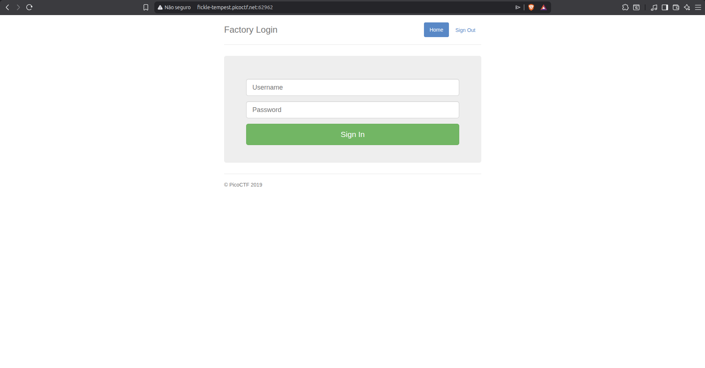
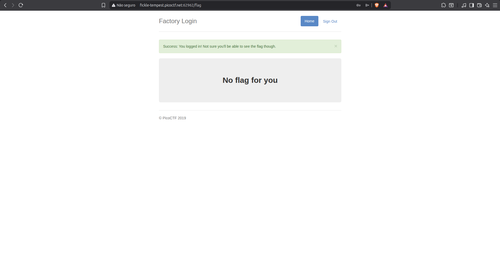
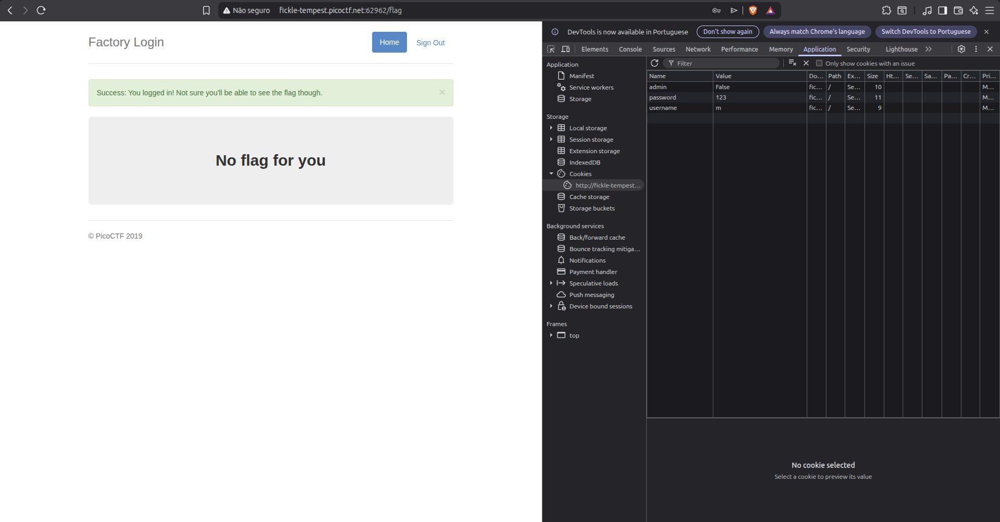
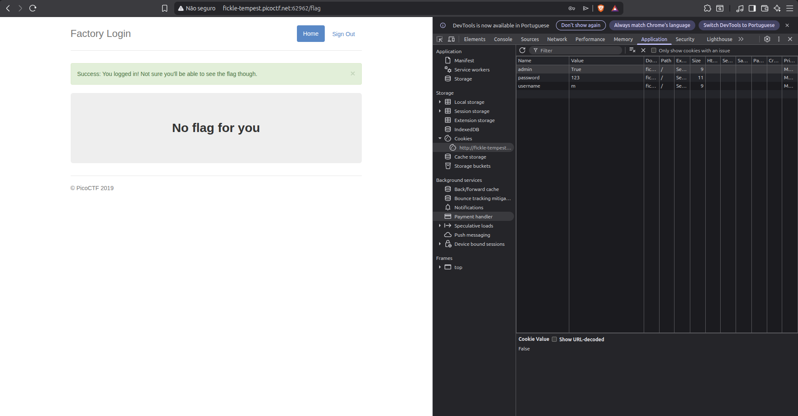
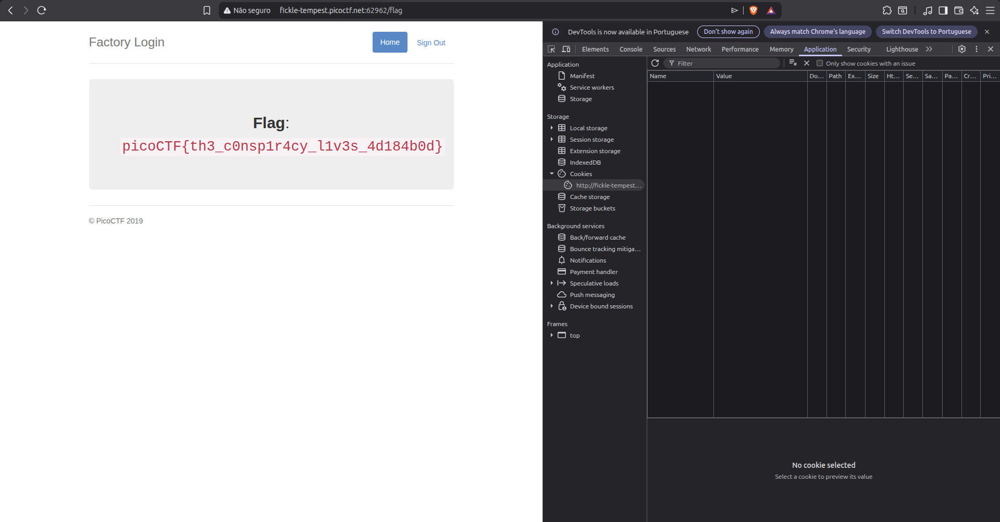

# Writeup — Logon
> Web Exploitation - cookie manipulation (admin privilege escalation)

## Overview

A web-based CTF challenge featuring a login page where admin privileges were controlled by a client-side cookie value, allowing trivial privilege escalation by manually editing the cookie in the browser.

---

## Methodology

After creating an account and signing in, the page denied access to the flag. Inspecting the browser's cookies via DevTools revealed an `admin` cookie set to `False`. Changing its value to `True` and refreshing the page granted admin access and exposed the flag.

---

## Exploitation

### Step 1 — Sign In (No Flag)

**Method:** Creating an account with arbitrary credentials and logging in  
**Location:** Homepage login form  
**Finding:** Successfully authenticated, but the page explicitly stated the flag was not accessible.

---

### Step 2 — Inspecting Cookies via DevTools

**Method:** Opening DevTools (`F12`) → **Application** tab → **Cookies**  
**Location:** Browser cookie storage for the challenge domain  
**Found:**

**Observation:** A cookie named `admin` was present with the value `False` — authorization was being enforced entirely client-side.

---

### Step 3 — Tampering the Cookie Value

**Method:** Double-clicking the cookie value in DevTools and rewriting `False` → `True`  
**Location:** Application → Cookies → `admin` field  
**Found:**

**Result:** Cookie updated to `admin=True`. Page refreshed.

---

### Step 4 — Flag Retrieved

**Method:** Refreshing the page after the cookie modification  
**Location:** Main page (now with admin privileges)  
**Found:**

---

## Completed Flag

**`picoCTF{th3_c0nsp1r4cy_l1v3s_4d184b0d}`**

---

## Tools Used

- Browser DevTools (`F12`) — Application → Cookies tab
- Manual cookie value editing

## Concepts

- **Never trust client-side authorization** — any cookie or localStorage value can be freely modified by the user
- Admin privilege checks must always be enforced **server-side**; a boolean cookie is not a security mechanism
- DevTools' Application tab is a go-to for inspecting and tampering with cookies during web CTFs
- Changing a single cookie value can be enough to escalate privileges when auth logic is client-side
