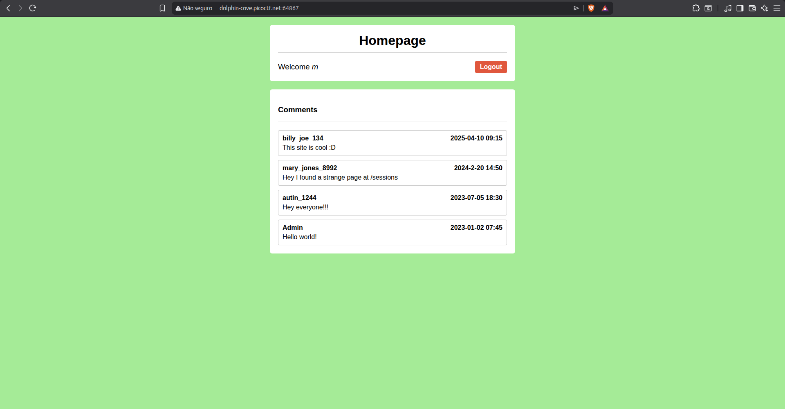
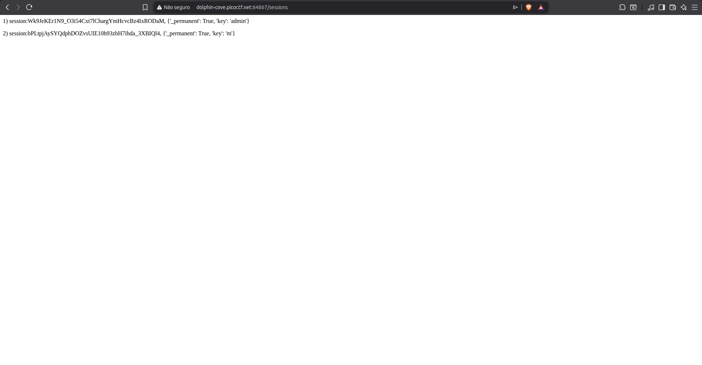
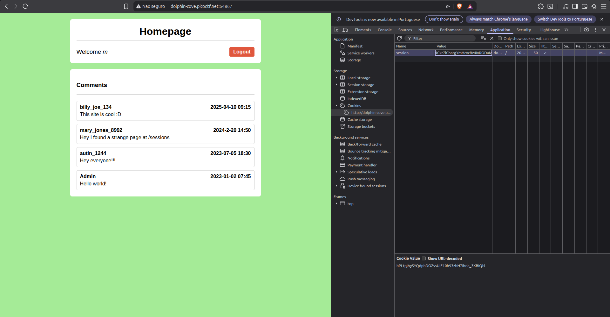
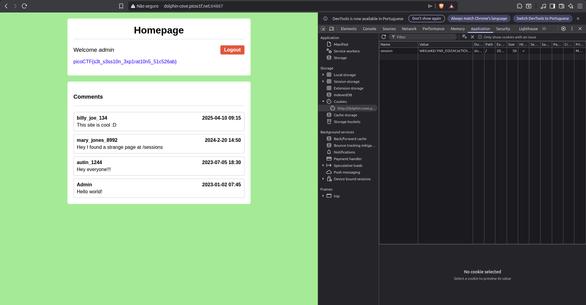

# WriteUp - Old Sessions (picoCTF)

> Session Hijacking via Exposed Session Storage

---

## Challenge Overview

This challenge demonstrates how dangerous insecure session management can be in web applications.

After creating an account and logging into the application, the objective was to escalate privileges and access the administrator account.

The vulnerability turned out to be an exposed sessions directory containing active authentication tokens.

By reusing an old administrator session, it was possible to perform a vertical privilege escalation without exploiting any complex vulnerability.

---

## Initial Recon

After registering a normal account and logging into the application, the homepage displayed several user comments.

One particular comment referenced something unusual involving a `/sessions` directory.

This immediately suggested:
- exposed session files
- insecure session storage
- possible session leakage

Homepage after login:



---

## Discovering the Sessions Directory

I manually modified the URL and attempted to access:

```text
/sessions
```

This technique is commonly known as:
- Forced Browsing
- Directory Enumeration
- Direct URL Access

The application exposed the directory publicly without authentication checks.

Inside the directory, there were multiple active session tokens.



At this point, the vulnerability became clear:
the server was exposing active session identifiers directly through a web-accessible directory.

---

## Identifying the Admin Session

Among the exposed session entries, one token appeared to belong to the administrator account.

Since session tokens represent authenticated users, possessing the administrator token would allow full session takeover.

The attack path became straightforward:

1. Copy the administrator session token
2. Replace the current user session cookie
3. Refresh the application
4. Inherit administrator privileges

---

## Session Hijacking

Using the browser DevTools:

- Opened:
  - `F12 → Application/Storage → Cookies`

- Located the current session cookie

- Replaced the user session token with the administrator token obtained from `/sessions`

Cookie replacement process:



After refreshing the page, the application recognized the session as the administrator account.

This resulted in:
- Session Hijacking
- Broken Access Control
- Vertical Privilege Escalation

---

## Capturing the Flag

Once authenticated as admin, the flag became accessible immediately.



---

## Vulnerability Analysis

This challenge contained several critical security flaws.

### 1. Exposed Session Storage

Sensitive session files were accessible directly through the web server.

Session data should never be exposed inside publicly accessible directories.

---

### 2. Improper Session Expiration

Old administrator sessions remained active instead of expiring automatically.

This allowed reuse of privileged authentication tokens.

---

### 3. Missing Authorization Validation

The application trusted session tokens blindly without validating:
- session origin
- device/IP changes
- token freshness
- privilege changes
- ---

## Lessons Learned

- Session tokens are equivalent to authentication credentials.
- Exposing session files can completely compromise an application.
- Old sessions should expire automatically.
- Broken session management is one of the most dangerous web vulnerabilities.
- Simple reconnaissance often reveals critical vulnerabilities.

This challenge is a great example of how a small configuration mistake can completely break application security.

---

## Concepts Practiced

- Web Exploitation
- Session Hijacking
- Cookie Manipulation
- Forced Browsing
- Broken Access Control
- Vertical Privilege Escalation
- Authentication Bypass

---

## Mitigations

Proper mitigations would include:

- Store session files outside the web root
- Implement strict session expiration
- Restrict directory access
- Rotate privileged sessions frequently
- Validate sessions server-side
- Monitor suspicious session reuse attempts

---

## Conclusion

This was a beginner-friendly but highly realistic web exploitation challenge.

By performing simple reconnaissance and manipulating cookies through browser DevTools, it was possible to fully compromise the administrator account.

The challenge reinforces how critical secure session handling is in modern web applications.
