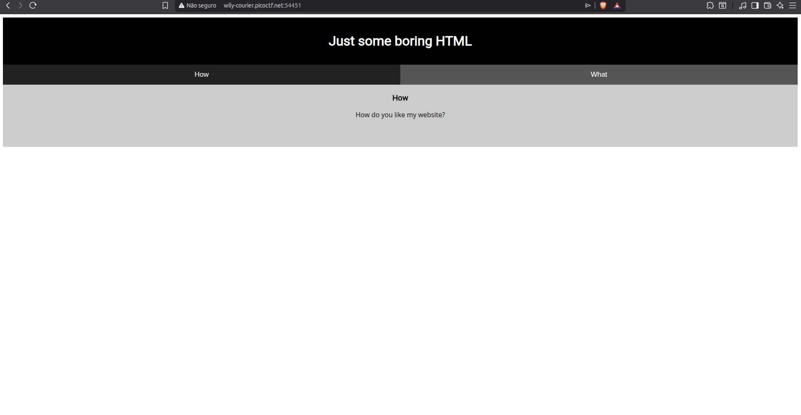
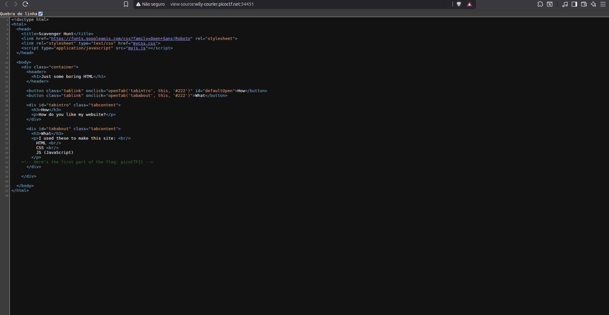
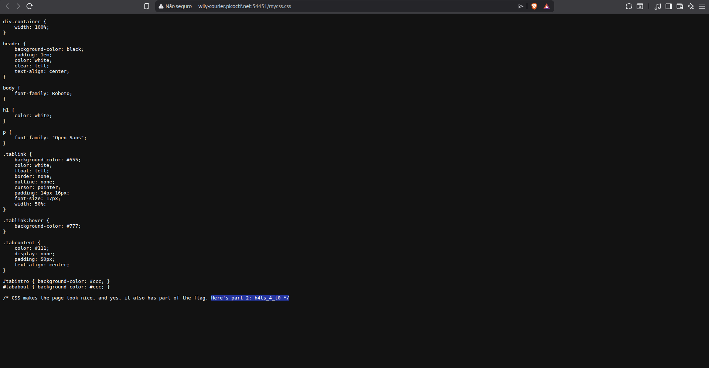
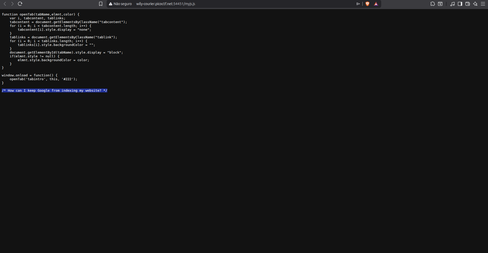
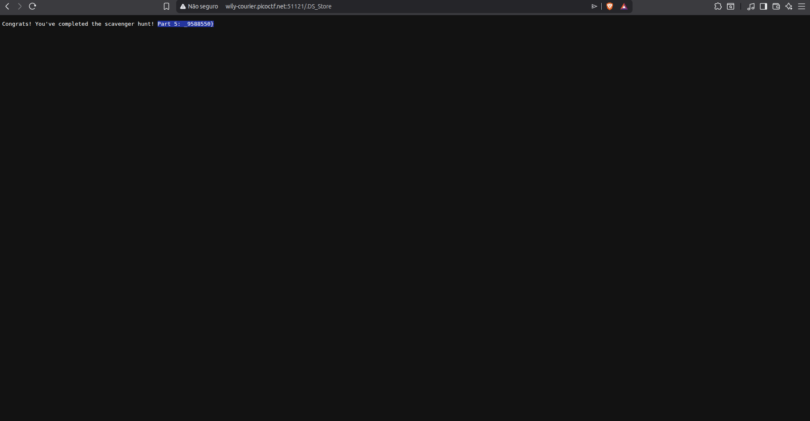

# Writeup — Scavenger Hunt
> Web Exploitation

## Overview
A web-based CTF challenge focused on finding flag parts hidden across common web files and server configurations.

**Target:** `wily-courier.picoctf.net:54451`

---

## Methodology
By inspecting the page source code, two external files were identified:
- `mycss.css` — contained a flag fragment in a CSS comment
- `myjs.js` — contained a flag fragment in a JS comment

The remaining parts were found by accessing well-known sensitivefiles that are often accidentally exposed on web servers.
Many parts in differents modules show hints, so I need to use them.

---

## Exploitation

### Part 1 — HTML Source Code
**Method:** Viewing the page source (`view-source:`)  
**Location:** HTML comment on line 31  
**Found:** 

**Fragment:** `picoCTF{t`

---
### Part 2 — CSS File
**Method:** Accessing `mycss.css` found in the HTML `<link>` tag  
**Location:** Comment inside the CSS source
**Found**

**Hint:** `/* How can I keep Google from indexing my website? */`  
**Fragment:** second part of the flag

---

### Part 3 — JavaScript File
**Method:** Accessing `myjs.js` found in the HTML `<script>` tag  
**Location:** Comment inside the JS source code  
**Found**

**Hint:** `" I love making websites on my Mac, I can Store a lot of information there."`  

---

### Part 4 — robots.txt / IDOR
**Method:** Accessing `/robots.txt` directly in the browser  
**Location:** `Disallow` entries revealing hidden paths 
**Found**

**Hint:** CSS comment referencing Google indexing  
**Fragment:** third part of the flag

---

### Part 5 — Apache .htaccess
**Method:** Accessing `/.htaccess` on the Apache server  
**Location:** Contents of the exposed configuration file  
**Found**

**Hint:** `# I think this is an apache server... can you Access the next flag?`  
**Fragment:** fourth part of the flag

---

### Part 5 — .DS_Store File
**Method:** Accessing `/.DS_Store` directly in the browser and downloading the file  
**Location:** Hidden macOS metadata file accidentally uploaded by the developer  
**Found**

**Hint:** `" I love making websites on my Mac, I can Store a lot of information there."`  
**Fragment:** fifth part of the flag

## Completed Flag
All 5 fragments combined resulted in the final flag:  
**`picoCTF{th4ts_4_l0t_0f_pl4c3s_2_lO0k_9588550}`**

---

## Tools Used
- Browser DevTools (source code inspection via `view-source:`)
- Direct URL access to sensitive files (`/robots.txt`, `/.htaccess`, `/.DS_Store`)
- `strings` command for `.DS_Store` parsing

## Concepts
- Sensitive information is often hidden in HTML, JS, and CSS comments
- Always check `robots.txt` for paths the developer wanted to hide
- Apache servers may expose `.htaccess` files with useful information
- Mac developers may accidentally upload `.DS_Store` files, leaking directory structure
- Inspecting all linked source files (`<script>`, `<link>`) is essential in web CTFs
