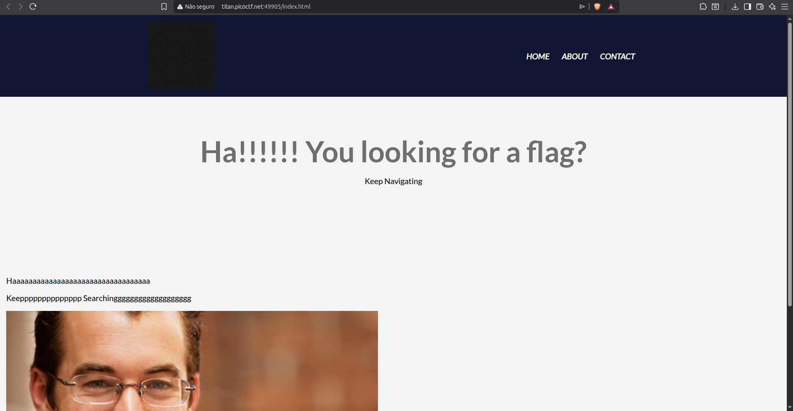
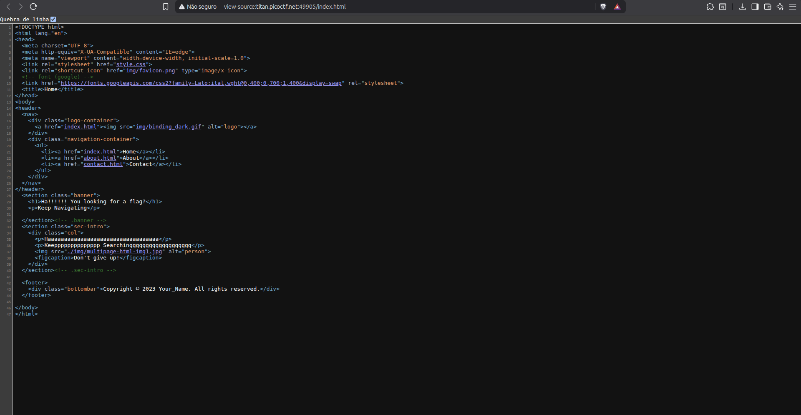
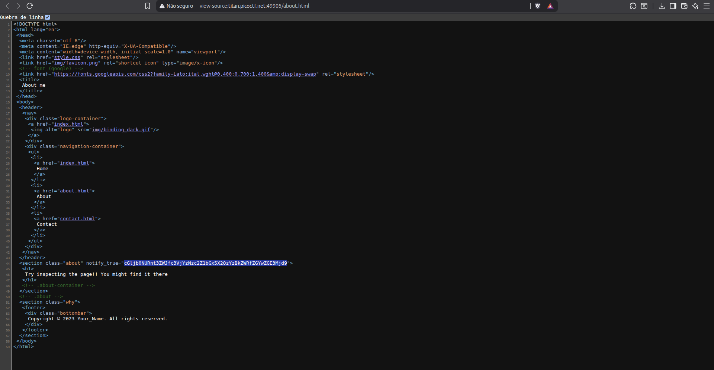
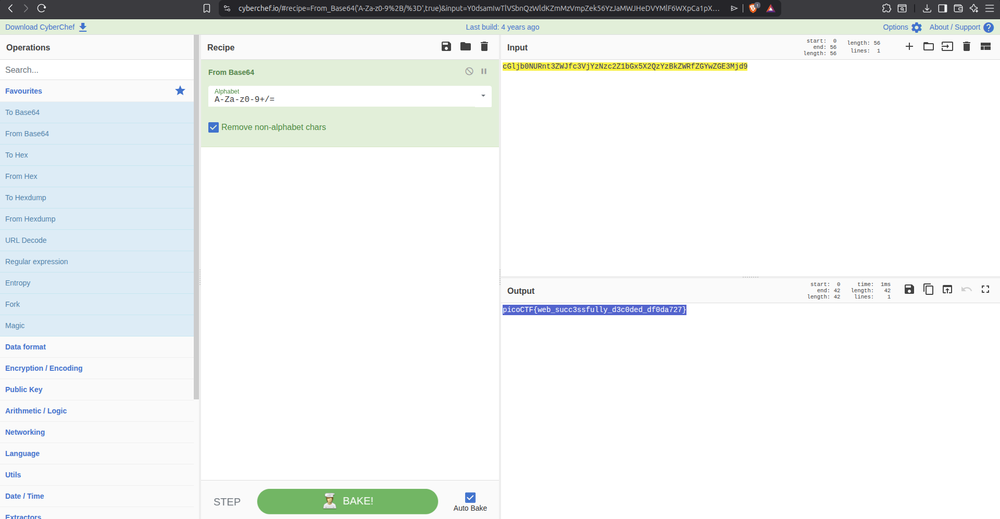

# Writeup — Web Decode
> Web Exploitation & Cryptography (Base64)

## Overview

A web-based CTF challenge focused on finding a flag hidden in the source code of a page, encoded in Base64.

---

## Methodology

By navigating through the site and inspecting the source code of each page, a suspicious Base64-encoded string was found hidden in the **About** page's HTML source. The string was then decoded using CyberChef, revealing the flag.

---

## Exploitation

### Step 1 — Homepage

**Method:** Accessing the provided challenge link  
**Location:** Homepage  
**Finding:** Nothing notable on the surface or in the page source.

---

### Step 2 — About Page Source Code

**Method:** Viewing the page source (`view-source:`) on the **About** page  
**Location:** HTML source — hidden Base64-encoded string  
**Found:**

**Observation:** A suspicious string was spotted embedded in the source code, matching the typical Base64 character pattern (`A-Z`, `a-z`, `0-9`, `+`, `/`, `=`).

---

### Step 3 — Decoding with CyberChef

**Method:** Pasting the string into [CyberChef](https://gchq.github.io/CyberChef/) and applying **From Base64**  
**Found:**

---

## Completed Flag

**`picoCTF{web_succ3ssfully_d3c0ded_df0da727}`**

---

## Tools Used

- Browser DevTools (source code inspection via `view-source:`)
- [CyberChef](https://gchq.github.io/CyberChef/) — `From Base64` operation

## Concepts

- Always inspect the source code of **every page**, not just the homepage
- Base64-encoded strings are easily recognizable by their character set and `=` padding suffix
- Hidden data is often embedded as HTML comments or obscure attribute values
- CyberChef is a fast and reliable tool for quick decoding tasks during CTFs
